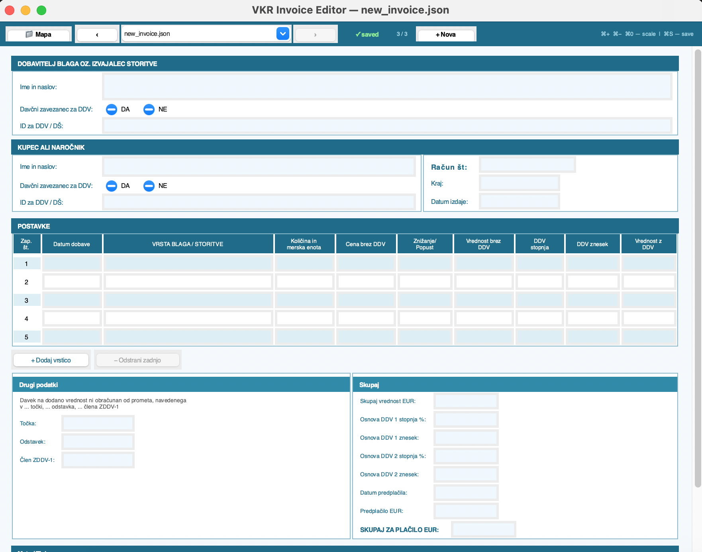

# VKR Invoice Editor

Desktop GUI tool for viewing and editing structured invoice data stored as JSON files.  
Built for working with digitized Slovenian *vezana knjiga računov* (bound invoice books) — a standard bookkeeping format used by sole proprietors.

  

## What it does

After invoices are extracted from scanned documents (via OCR or other tools), the resulting JSON files need manual review and correction. This editor provides a visual form interface that maps directly to the Slovenian invoice structure, making it faster and less error-prone than editing raw JSON.



## Features

- **Visual form layout** matching the physical invoice structure (supplier, buyer, line items, VAT, totals)
- **Folder-based workflow** — browse and navigate all JSON files in a folder with arrow buttons or dropdown
- **DA/NE radio toggle** for VAT taxpayer fields (mutually exclusive selection)
- **Auto-numbered item rows** (1–9) with add/remove controls
- **Create new invoices** from a built-in empty template
- **Delete files** with confirmation dialog
- **Edit tracking** — visual saved/edited status indicator
- **Keyboard shortcuts** — Cmd+S to save, Cmd+/−/0 for UI scaling
- **Folder picker** — switch working directories without restarting

## Installation

No external dependencies — uses only Python standard library (Tkinter).

```bash
# Tkinter is included with Python on most systems.
# On Ubuntu/Debian, if missing:
sudo apt-get install python3-tk
```

## Usage

Launch with folder picker:
```bash
python3 cheque_editor.py
```

Open a specific folder:
```bash
python3 cheque_editor.py --dir /path/to/json/folder
```

## JSON structure

The editor expects JSON files with the following structure:

```json
{
  "racun": {
    "dobavitelj": {
      "ime_in_naslov": "",
      "davčni_zavezanec_za_DDV": "DA",
      "ID_za_DDV_DS": ""
    },
    "kupec": {
      "ime_in_naslov": "",
      "davčni_zavezanec_za_DDV": "NE",
      "ID_za_DDV_DS": "",
      "racun_st": "",
      "kraj_in_datum_izdaje": { "kraj": "", "datum": "" }
    },
    "postavke": [
      {
        "zap_st": "1",
        "datum_dobave": "",
        "vrsta_blaga_storitve": "",
        "kolicina_in_merska_enota": "",
        "cena_na_enoto_brez_DDV": "",
        "znesek_znizanja_popust": "",
        "vrednost_brez_DDV": "",
        "DDV": { "DDV_stopnja": "", "DDV_znesek": "" },
        "vrednost_z_DDV": ""
      }
    ],
    "skupaj": { "skupaj_za_placilo_EUR": "" },
    "meta": { "izdajatelj_zaloznik": "" }
  }
}
```

New files can be created directly from the editor using the **+ Nova** button — they are pre-filled with this empty template.

## Tech stack

- Python 3.10+
- Tkinter (standard library)
